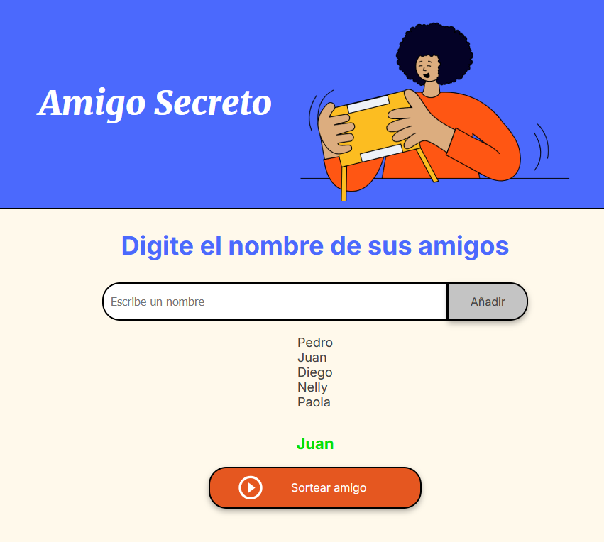

# Amigo Secreto

Este proyecto es una aplicación web que permite a los usuarios ingresar nombres de amigos y realizar un sorteo para elegir al "amigo secreto". La aplicación se basa en HTML, CSS y JavaScript.

## Descripción

El objetivo principal de este desafío es fortalecer las habilidades en lógica de programación. La aplicación permite:

- Agregar amigos mediante un campo de entrada.
  
  
- Visualizar la lista de amigos ingresados en la interfaz.

  

- Sortear aleatoriamente un amigo de la lista.

  

  
La lógica principal se encuentra en el archivo [app.js](app.js), que contiene las funciones para agregar amigos, actualizar la lista y realizar el sorteo.

## Estructura del Proyecto
├── index.html # Archivo principal de la interfaz HTML
├── style.css # Archivo de estilos CSS para la UI 
└── app.js # Archivo JavaScript con la lógica de la aplicación (agregar, actualizar y sortear amigos)
## Instalación

1. Clona el repositorio o descarga los archivos del proyecto.
2. Abre el proyecto en Visual Studio Code.
3. Abre el archivo `index.html` en tu navegador (puedes usar Live Server si tienes la extensión) para ver la aplicación en funcionamiento.

## Uso

- Ingresa un nombre en el campo de entrada y haz clic en el botón **Añadir** para agregar un amigo a la lista.
- La lista de amigos se actualizará automáticamente en la interfaz.
- Una vez agregados los amigos, haz clic en **Sortear amigo** para elegir aleatoriamente un nombre del array. El nombre sorteado se mostrará en el elemento de resultado.

## Dependencias

Este proyecto no utiliza dependencias externas. Todos los recursos son autogestionados mediante archivos locales (HTML, CSS y JavaScript).

## Posibles Problemas y Soluciones

- **Campo de entrada vacío:**  
  Se muestra un mensaje de alerta solicitando ingresar un nombre.

  
  
- **Sin amigos para sortear:**  
  Si no hay amigos en la lista, se muestra una alerta indicando que no hay amigos para sortear.
